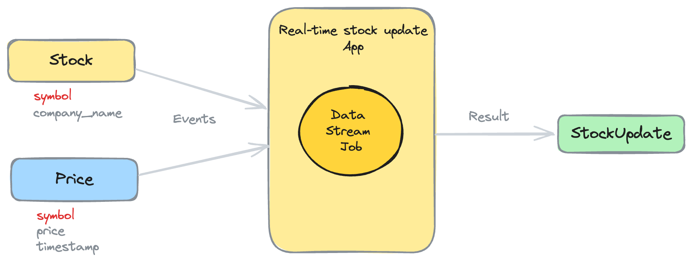
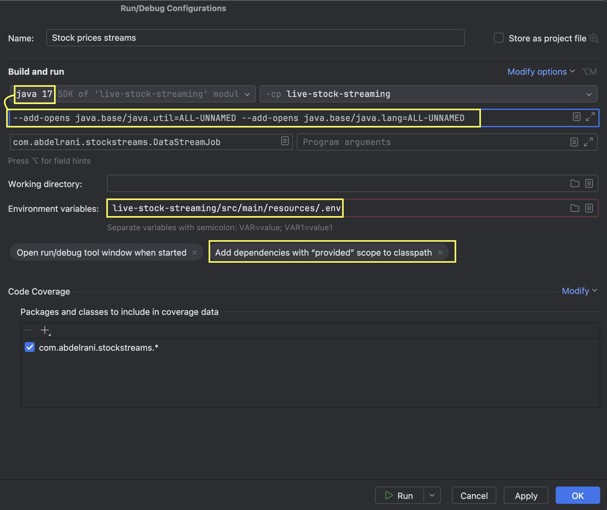

# Stock price live updates using Apache Flink and Apache kafka

This project is a simple example of how to use Apache Flink and Apache Kafka to process live stock price updates. The Flink job reads the stock and price updates from two different topics in Kafka, perform some filtering and joining operations, and then writes the results to another Kafka topic.

## Blog post
This project is the code source for the blog post [Real-time data streaming using Apache Flink and Kafka](https://abdelrani.com/blog/streaming-data-using-apache-flink).

## Overview of the project
Here is a high-level overview of the project:

## Pre-requisites
- Java 17
- Apache Flink 1.18
- Apache Kafka

## Running the project
1. Start Apache Kafka
2. Create the following topics in Kafka:
   - `price`
   - `stock`
   - `stock_update`

3. Before running the Main class, you need to configure the run configuration in your IDE :

> The `ALL-UNAMED` parameters are required for Java 17 support.
> They can be safely removed when using Java 8/11.

